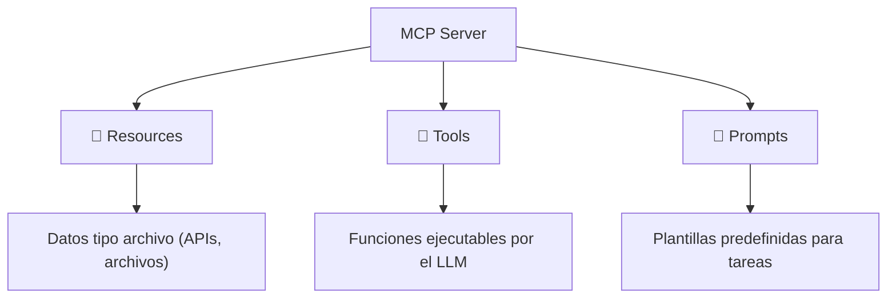
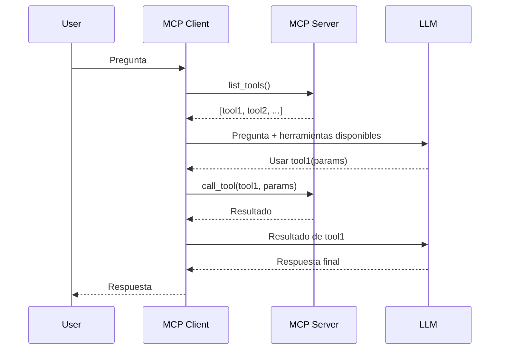
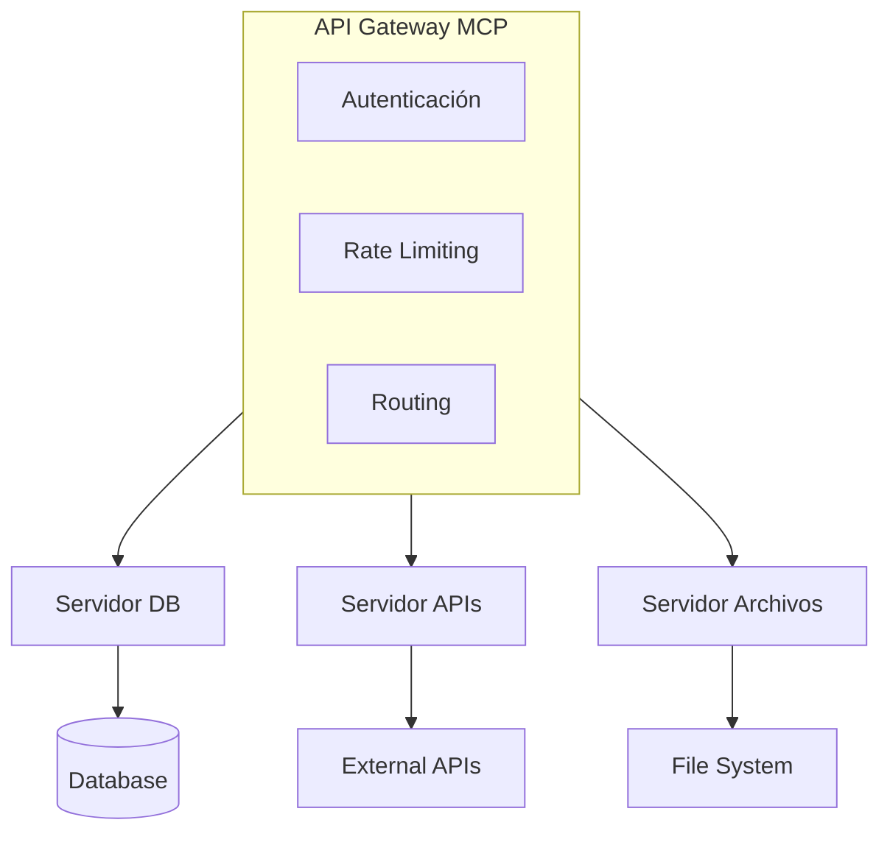
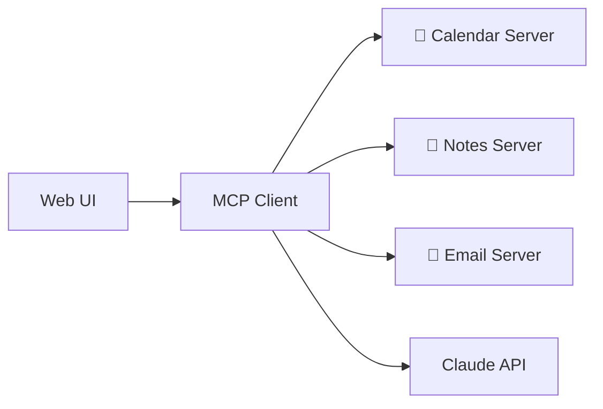

# 🚀 Ruta de Aprendizaje MCP: De Principiante a Pro

> **Model Context Protocol (MCP)** es un estándar abierto desarrollado por Anthropic que permite a los modelos de IA conectarse con fuentes de datos externas y herramientas de manera segura y estandarizada.

> [!TIP] > **¡No necesitas Claude Desktop!** Antigravity ya tiene soporte MCP integrado con `list_resources` y `read_resource`. Puedes practicar todo directamente aquí.

---

## 📊 Visión General

```mermaid
flowchart LR
    subgraph Nivel1["🌱 Nivel 1: Fundamentos"]
        A1[Conceptos Básicos]
        A2[Arquitectura MCP]
        A3[Primer Servidor]
    end

    subgraph Nivel2["🌿 Nivel 2: Intermedio"]
        B1[Resources]
        B2[Tools]
        B3[Prompts]
        B4[Transports]
    end

    subgraph Nivel3["🌳 Nivel 3: Avanzado"]
        C1[Clientes MCP]
        C2[Seguridad]
        C3[Deploy Producción]
    end

    subgraph Nivel4["⭐ Nivel 4: Pro"]
        D1[Servidores Enterprise]
        D2[Contribuir al Ecosistema]
        D3[Patrones Avanzados]
    end

    Nivel1 --> Nivel2 --> Nivel3 --> Nivel4
```



---

## 🌱 Nivel 1: Fundamentos (Semana 1-2)

### 1.1 ¿Qué es MCP?

| Concepto         | Descripción                                                                     |
| ---------------- | ------------------------------------------------------------------------------- |
| **MCP**          | Protocolo abierto para conectar modelos de IA con datos y herramientas externas |
| **Servidor MCP** | Expone datos y funcionalidades a los clientes de IA                             |
| **Cliente MCP**  | Aplicaciones que se conectan a servidores MCP (Antigravity, IDEs, etc.)         |
| **Host**         | Aplicación que orquesta la comunicación entre clientes y servidores             |

### 1.2 ¿Por qué MCP importa?

-   **Desarrolladores**: Reduce tiempo y complejidad al integrar IA con aplicaciones
-   **Aplicaciones IA**: Acceso a ecosistema de datos, herramientas y apps
-   **Usuarios finales**: Aplicaciones más capaces que acceden a tus datos

### 1.3 Casos de Uso Reales

-   📅 Agentes que acceden a Google Calendar y Notion
-   🎨 IA generando apps desde diseños de Figma
-   💼 Chatbots empresariales conectando múltiples bases de datos
-   🖨️ IA creando diseños 3D en Blender e imprimiéndolos

### 📚 Recursos Nivel 1

| Recurso              | URL                                                                                                        |
| -------------------- | ---------------------------------------------------------------------------------------------------------- |
| Introducción Oficial | [modelcontextprotocol.io/introduction](https://modelcontextprotocol.io/introduction)                       |
| Arquitectura         | [modelcontextprotocol.io/docs/learn/architecture](https://modelcontextprotocol.io/docs/learn/architecture) |
| GitHub MCP           | [github.com/modelcontextprotocol](https://github.com/modelcontextprotocol)                                 |

### ✅ Tareas Nivel 1

-   [x] Leer la documentación de introducción completa
-   [x] Entender la diferencia entre Host, Cliente y Servidor
-   [ ] Configurar un servidor MCP de ejemplo y probarlo con Antigravity
-   [ ] Experimentar con servidores MCP pre-construidos

---

## 🌿 Nivel 2: Intermedio (Semana 3-4)

### 2.1 Los 3 Pilares de MCP



#### 📁 Resources (Recursos)

-   Datos similares a archivos que pueden ser leídos por clientes
-   Ejemplos: respuestas de APIs, contenido de archivos, datos de BD

#### 🔧 Tools (Herramientas)

-   Funciones que pueden ser llamadas por el LLM
-   Requieren aprobación del usuario para ejecutarse
-   Ejemplos: `get_weather()`, `send_email()`, `query_database()`

#### 📝 Prompts

-   Plantillas pre-escritas para tareas específicas
-   Ayudan a usuarios a lograr objetivos comunes
-   Ejemplos: "Resume este documento", "Genera código para..."

### 2.2 Transports (Comunicación)

| Transport    | Uso    | Descripción                              |
| ------------ | ------ | ---------------------------------------- |
| **stdio**    | Local  | Comunicación por entrada/salida estándar |
| **HTTP/SSE** | Remoto | Server-Sent Events sobre HTTP            |

### 2.3 Tu Primer Servidor MCP

#### Requisitos del Sistema

-   Python 3.10+ o Node.js 18+
-   MCP SDK 1.2.0+

#### Setup con Python

```bash
# Instalar uv (gestor de paquetes moderno)
curl -LsSf https://astral.sh/uv/install.sh | sh

# Crear proyecto
uv init mi-servidor-mcp
cd mi-servidor-mcp

# Instalar dependencias
uv venv
source .venv/bin/activate  # Linux/Mac
# .venv\Scripts\activate   # Windows

uv add "mcp[cli]" httpx
```

#### Setup con TypeScript

```bash
# Crear proyecto
mkdir mi-servidor-mcp && cd mi-servidor-mcp
npm init -y

# Instalar SDK
npm install @modelcontextprotocol/sdk
```

### 📚 Recursos Nivel 2

| Recurso               | URL                                                                                                              |
| --------------------- | ---------------------------------------------------------------------------------------------------------------- |
| Quickstart Server     | [modelcontextprotocol.io/quickstart](https://modelcontextprotocol.io/quickstart)                                 |
| Conceptos de Servidor | [modelcontextprotocol.io/docs/learn/server-concepts](https://modelcontextprotocol.io/docs/learn/server-concepts) |
| SDK Python            | [github.com/modelcontextprotocol/python-sdk](https://github.com/modelcontextprotocol/python-sdk)                 |
| SDK TypeScript        | [github.com/modelcontextprotocol/typescript-sdk](https://github.com/modelcontextprotocol/typescript-sdk)         |

### ✅ Tareas Nivel 2

-   [ ] Construir servidor MCP del clima (tutorial oficial)
-   [ ] Implementar al menos 2 Tools personalizados
-   [ ] Agregar Resources a tu servidor
-   [ ] Crear Prompts reutilizables
-   [ ] Conectar tu servidor con Antigravity usando `list_resources`

---

## 🌳 Nivel 3: Avanzado (Semana 5-6)

### 3.1 Construir Clientes MCP

Un cliente MCP es una aplicación que:

1. Se conecta a uno o más servidores MCP
2. Lista herramientas/recursos disponibles
3. Ejecuta herramientas cuando el LLM lo solicita



### 3.2 Seguridad en MCP

> [!CAUTION]
> La seguridad es crítica cuando das acceso a IA a tus sistemas

| Aspecto       | Mejor Práctica                 |
| ------------- | ------------------------------ |
| Autenticación | Implementar OAuth2 o API keys  |
| Autorización  | Principio de mínimo privilegio |
| Validación    | Sanitizar TODAS las entradas   |
| Logging       | Registrar todas las acciones   |
| Rate Limiting | Limitar frecuencia de llamadas |

### 3.3 Best Practices de Logging

```python
# ❌ MAL (stdout interfiere con stdio transport)
print("Processing request")

# ✅ BIEN (usa stderr o logging)
import logging
logging.info("Processing request")
```

### 📚 Recursos Nivel 3

| Recurso           | URL                                                                                                            |
| ----------------- | -------------------------------------------------------------------------------------------------------------- |
| Build Client      | [modelcontextprotocol.io/docs/develop/build-client](https://modelcontextprotocol.io/docs/develop/build-client) |
| Lista de Clientes | [modelcontextprotocol.io/clients](https://modelcontextprotocol.io/clients)                                     |
| Debugging Guide   | [modelcontextprotocol.io/docs/develop/debugging](https://modelcontextprotocol.io/docs/develop/debugging)       |

### ✅ Tareas Nivel 3

-   [ ] Construir un cliente MCP básico
-   [ ] Implementar autenticación en tu servidor
-   [ ] Agregar logging estructurado
-   [ ] Manejar errores graciosamente
-   [ ] Probar con múltiples servidores simultáneos

---

## ⭐ Nivel 4: Pro (Semana 7-8+)

### 4.1 Servidores Enterprise



| Característica         | Descripción                            |
| ---------------------- | -------------------------------------- |
| **Connection Pooling** | Reutilizar conexiones a BD/APIs        |
| **Caching**            | Cache inteligente de recursos          |
| **Load Balancing**     | Distribuir carga entre instancias      |
| **Observability**      | Métricas, traces, y logs centralizados |
| **Graceful Shutdown**  | Cerrar conexiones apropiadamente       |

### 4.2 SDKs Disponibles

| Lenguaje   | Estado     | Repositorio                                                              |
| ---------- | ---------- | ------------------------------------------------------------------------ |
| Python     | ✅ Oficial | [python-sdk](https://github.com/modelcontextprotocol/python-sdk)         |
| TypeScript | ✅ Oficial | [typescript-sdk](https://github.com/modelcontextprotocol/typescript-sdk) |
| Java       | ✅ Oficial | [java-sdk](https://github.com/modelcontextprotocol/java-sdk)             |
| Kotlin     | ✅ Oficial | [kotlin-sdk](https://github.com/modelcontextprotocol/kotlin-sdk)         |
| C#         | ✅ Oficial | [csharp-sdk](https://github.com/modelcontextprotocol/csharp-sdk)         |
| Rust       | ✅ Oficial | [rust-sdk](https://github.com/modelcontextprotocol/rust-sdk)             |

### ✅ Tareas Nivel 4

-   [ ] Construir servidor que integre múltiples APIs
-   [ ] Implementar caching y pooling de conexiones
-   [ ] Crear un cliente MCP personalizado para tu caso de uso
-   [ ] Publicar un servidor en el ecosistema MCP
-   [ ] Contribuir al SDK de tu lenguaje preferido

---

## 🎯 Proyecto Final Sugerido

### Sistema de Asistente Personal MCP



1. **Servidor de Calendario** - Acceso a Google Calendar
2. **Servidor de Notas** - Integración con Notion/Obsidian
3. **Servidor de Email** - Lectura y envío de emails

---

## 📅 Plan de Estudio Semanal

| Semana | Nivel          | Enfoque                        | Horas/Semana |
| ------ | -------------- | ------------------------------ | ------------ |
| 1-2    | 🌱 Fundamentos | Conceptos, arquitectura, setup | 5-8h         |
| 3-4    | 🌿 Intermedio  | Resources, Tools, Prompts      | 8-10h        |
| 5-6    | 🌳 Avanzado    | Clientes, seguridad, deploy    | 10-12h       |
| 7-8+   | ⭐ Pro         | Enterprise, contribución       | 10-15h       |

---

## 🔗 Enlaces Rápidos

| Recurso                  | Enlace                                                                                                   |
| ------------------------ | -------------------------------------------------------------------------------------------------------- |
| 📖 Documentación Oficial | [modelcontextprotocol.io](https://modelcontextprotocol.io)                                               |
| 💻 GitHub Organization   | [github.com/modelcontextprotocol](https://github.com/modelcontextprotocol)                               |
| 🚀 Quickstart            | [modelcontextprotocol.io/quickstart](https://modelcontextprotocol.io/quickstart)                         |
| 📦 Example Servers       | [github.com/modelcontextprotocol/servers](https://github.com/modelcontextprotocol/servers)               |
| 🐍 Python SDK            | [github.com/modelcontextprotocol/python-sdk](https://github.com/modelcontextprotocol/python-sdk)         |
| 📘 TypeScript SDK        | [github.com/modelcontextprotocol/typescript-sdk](https://github.com/modelcontextprotocol/typescript-sdk) |

---

> **¡Buena suerte en tu viaje para dominar MCP!** 🎉
